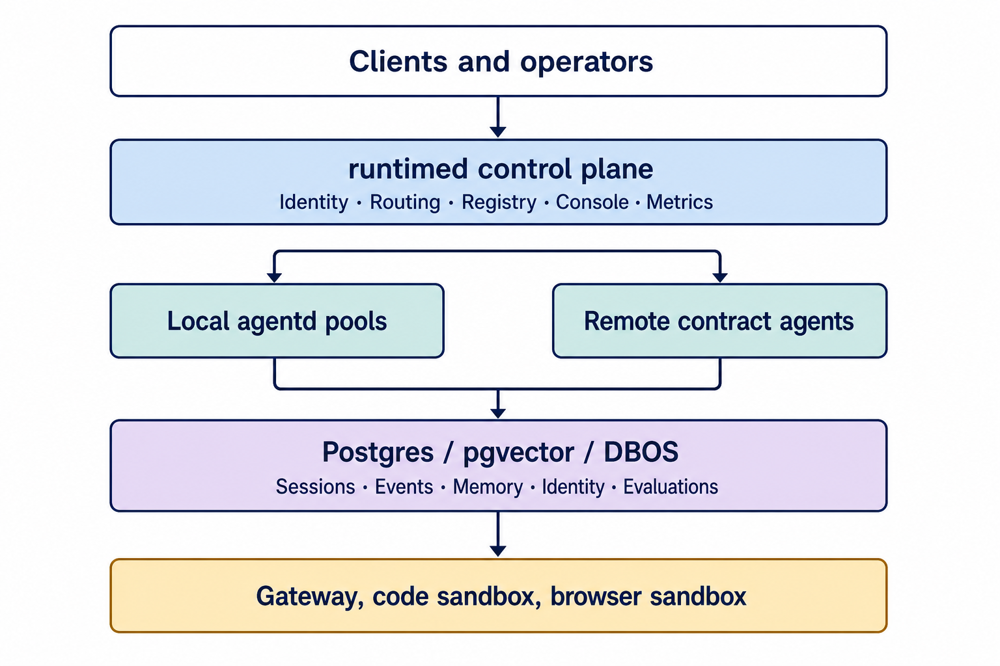

# Runtime

Runtime is a self-hosted platform for running durable AI agents. It gives local
and remote agents a shared control plane for sessions, routing, identity, tools,
memory, isolated code and browser execution, evaluations, metrics, and tracing.

Runtime provides the infrastructure around an agent. Your application still
owns the agent's instructions, model, domain tools, safety policy, and user
experience.

## Status

Runtime is pre-release software. The latest tagged release is `v0.2.0`, while
the default branch contains unreleased changes.

The repository does not yet include a licence. The source is available to read,
but no reuse or redistribution rights are granted until a licence is added.

## Start here

| Goal | Guide |
|---|---|
| Understand Runtime and its boundaries | [Runtime overview](runtime.md) |
| Run the complete stack on one host | [Quickstart](quickstart.md) |
| Configure agents and the control plane | [Configuration reference](configuration.md) |
| Operate and secure a deployment | [Operator guide](operator-guide.md) |
| Onboard a tenant and invoke agents | [Tenant guide](tenant-guide.md) |
| Integrate an agent or use the CLI and API | [Interfaces and development](interfaces-and-development.md) |

More detailed guides cover:

- [identity, secrets, and memory](identity-and-memory.md);
- [the tool gateway and sandboxes](gateway-and-sandboxes.md);
- [metrics, logs, traces, dashboards, and alerts](observability.md);
- [offline and online evaluations](evals.md);
- [SDK and custom-agent deployment](deploying-sdk-agents.md);
- [TLS-secured single-host deployment](deploy/secured/README.md); and
- [Kubernetes deployment with Helm](deploy/charts/runtime/README.md).

Worked agents are available under [`examples/`](examples/). See the
[security policy](SECURITY.md) before reporting a vulnerability and the
[contribution guide](CONTRIBUTING.md) before proposing a change.

## Architecture



The main components are:

- `runtimed`: the control plane and local-process supervisor;
- `agentd`: the bundled native Go agent host;
- `runtimectl`: the operator CLI;
- `agentruntime`: the Go library that exposes a harness agent as a durable
  HTTP/SSE service; and
- contract shims and examples for agents written with other SDKs.

## Capabilities and boundaries

| Area | Runtime provides | Boundary to understand |
|---|---|---|
| Durable sessions | Completed-turn recovery and replayable SSE events for native Go agents | A tool side effect can repeat if the process fails before the turn is checkpointed |
| Agent hosting | Local processes, replica pools, autoscaling, and remote agents | A session remains pinned to its owner replica |
| Identity | OIDC, service keys, tenant roles, and encrypted tenant secrets | Open mode is for local development only |
| Gateway | Tenant-aware MCP and REST/OpenAPI federation, policy, quotas, and search | Dynamically registered targets must use public HTTP(S) endpoints |
| Memory | Tenant- and actor-scoped durable memory, semantic recall, extraction, and retention | Memory is shared within an agent tenant unless actor scoping is enabled |
| Sandboxes | Per-session code and browser containers with resource and network controls | Access to the Docker socket makes the host a trusted boundary |
| Evaluations | Golden sets, rule and judge scoring, online sampling, and retention | Transcript redaction is best effort; evaluations are not a deployment gate |
| Operations | Health checks, fleet metrics, tracing, dashboards, alerts, CLI, and console | The turnkey deployment has one control-plane replica |

For the full architecture and reliability model, read the
[Runtime overview](runtime.md).

## Run the turnkey stack

The complete single-host stack requires Docker with Compose v2:

```bash
make compose-init
make compose-build
make compose-up
```

`compose-init` creates `deploy/compose/.env` with a bootstrap key, secrets
keyring, and Grafana administrator password. The web console is then available
at <http://localhost:8080/ui>.

Read the [quickstart](quickstart.md) for prerequisites and verification, then
use the [operator guide](operator-guide.md) before exposing the deployment.

## Run a local development instance

Local development requires Go 1.25.12 or later and Postgres. The supplied
database target uses Docker:

```bash
make pg-up
make build
make run
```

The example [`runtime.yaml`](runtime.yaml) starts two deterministic agents:

```bash
./bin/runtimectl agents
./bin/runtimectl invoke --agent support "hello"
./bin/runtimectl sessions --agent support
./bin/runtimectl conformance --agent support
```

`runtimectl` reads the control-plane address from `RUNTIME_CTL_URL` and an
optional bearer credential from `RUNTIME_TOKEN`.

## Configure an agent

Runtime rejects unknown YAML fields, additional YAML documents, unsafe
identifiers, invalid durations, colliding ports, and incompatible local and
remote settings.

```yaml
agents:
  - id: support
    name: Support Agent
    model: test/scripted
    listen_addr: 127.0.0.1:8101
    registration_generation: 89ef9a06-e752-49e2-a8bc-a9b14983dc6f
    replicas: 2
    memory: true
    gateway: search
    limits:
      max_turns: 20
      max_tokens: 100000
      turn_timeout: 2m
      session_timeout: 30m
```

Set `RUNTIME_CONFIG` to use a different configuration file. See
[`runtime.yaml`](runtime.yaml) for worked examples and the
[configuration reference](configuration.md) for every supported field and
environment variable.

## Integrate an agent

The control-plane API exposes agent-specific session routes under
`/agents/{id}/...`:

```bash
curl -sS -X POST http://localhost:8080/agents/support/sessions \
  -H 'Content-Type: application/json' \
  -d '{"message":"hello"}'

curl -N \
  'http://localhost:8080/agents/support/sessions/ses-.../stream?since=0'
```

When identity is enabled, send `Authorization: Bearer <service-key>`.

Native Go agents use `agentruntime`. Python agents can use the supplied
contract shim, and agents in any language can implement the HTTP/SSE contract
directly. Read [Interfaces and development](interfaces-and-development.md) for
the contract and conformance test, or [Deploying SDK and custom
agents](deploying-sdk-agents.md) for end-to-end examples.

## Security notes

- The authenticated control-plane API is the tenant security boundary.
- A local `agentd` is a trusted platform process, not a hostile-code sandbox.
  Put less-trusted agent code behind a remote container or VM boundary.
- Code and browser containers reduce application-level risk, but a service
  with access to the Docker socket remains privileged on the host.
- Terminate TLS at the deployment edge.
- Make side-effecting tools idempotent: recovery is at least once for an
  incomplete turn.

The turnkey stack is a single-node operational profile, not a hostile
multi-tenant cloud isolation boundary. See the [operator
guide](operator-guide.md) and [security policy](SECURITY.md) for the complete
security model.
